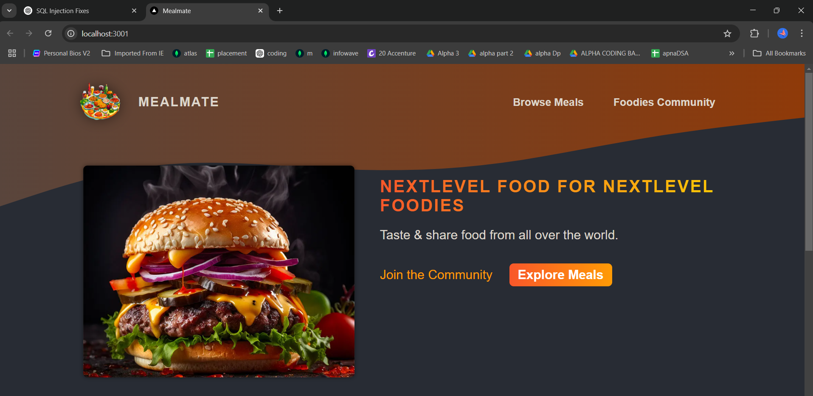
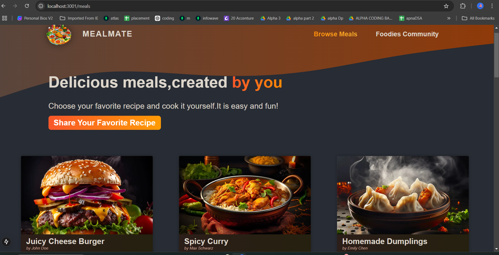
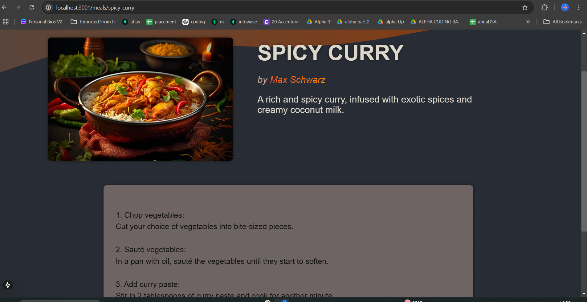
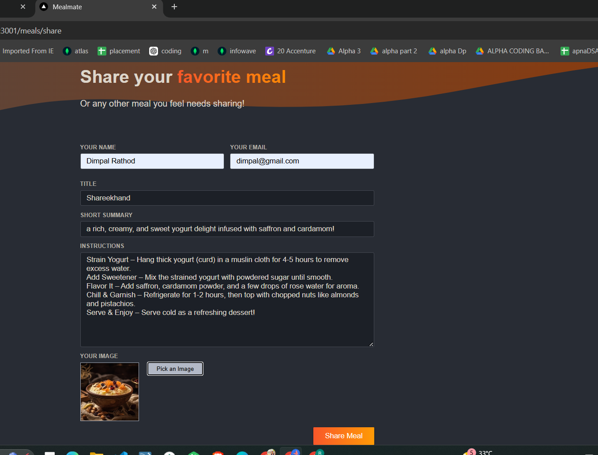
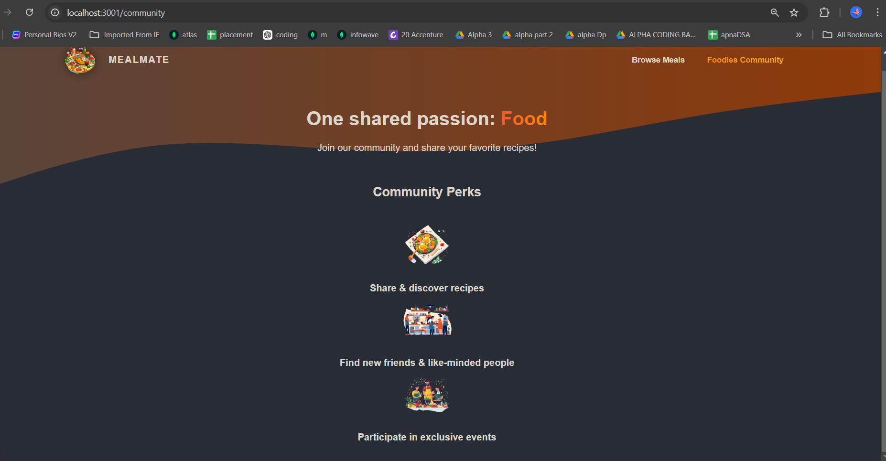

# MealMate 🍽️

MealMate is a Next.js web application where users can share food experiences, discover new meals, and engage in a vibrant food community. It includes form validation, error handling, and a seamless user experience.

🌟 Features:
🥘 Food Community - Share your favorite meals with others.
📸 Food Sharing - Upload meal images with descriptions.
✅ React Form Validation - Ensures data integrity and better performance.
⚡ Optimized Performance - Uses Next.js best practices.
🎭 Error Handling - Custom error pages, 404 Page Not Found, and global error boundaries.

🛠️ Tech Stack
Frontend: Next.js, React , Tailwind CSS
Backend: Node.js, SQLite
State Management: useState, useReducer, useActionState
Image Handling: Next.js Image Optimization
Validation: React Hook Form, Custom Error Handling

🛡️ Error HandlingGlobal Error Page (app/error.js)
404 - Page Not Found (app/not-found.js)
Validation Errors handled using React Hook Form

🚀 Getting Started
1.Clone the repository:
git clone https://github.com/yourusername/MealMate.git
2.Install dependencies:
npm install
3.Run the development server:
npm run dev
4.Open http://localhost:3000 in your browser.